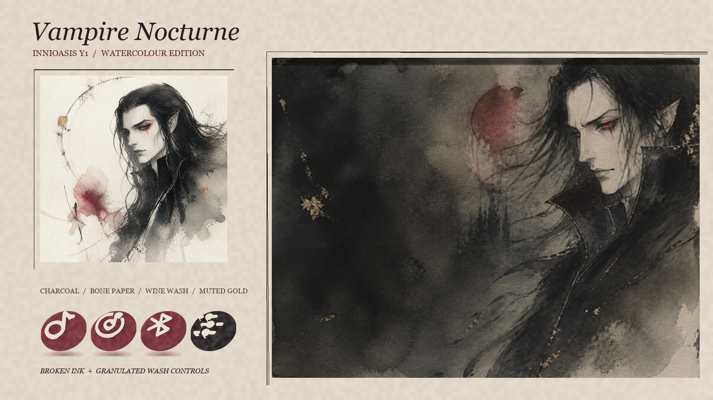

# Innioasis Vampire Nocturne Theme

An install-ready watercolor-and-ink theme for the stock Innioasis Y1 music player.  Liven up your Innioasis with a fresh theme : ) easy to download easy to install

## The handmade direction

- Original asymmetrical watercolor-and-ink wallpaper and cover
- Visible paper grain, wash blooms, dry brush and incomplete edges
- Flat wine and charcoal controls instead of glossy rendered surfaces
- Pale paper glyphs with slight tonal variation
- Irregular pooled-wash selected-item and dialog panels
- Muted gold flecks used sparingly rather than symmetrical ornament
- Separate darker global wallpaper for readable submenu text
- Complete home and settings coverage, including the newer `ebook` entry

## Install

1. Download `Vampire-theme.zip` from this repository and extract it, or clone the repository.
2. Connect the Innioasis Y1 to your computer and enable USB mode.
3. Copy the complete `Vampire` folder into the player's `Themes` folder. On the player this is `/storage/sdcard0/Themes/Vampire/`.
4. Open the Y1 app, then choose **Settings → Theme → Vampire Nocturne** and confirm.

Keep `config.json`, `cover.png`, and every referenced PNG together inside the `Vampire` folder. File names are case-sensitive on the player.

## Palette

- Charcoal ink `#251E20`
- Bone paper `#EFE7DA`
- Smoke wash `#51494A`
- Wine wash `#6B2331`
- Faded crimson `#A45B63`
- Muted gold `#977B48`

## Local working copy

The same upgraded package is installed at `D:\Themes\Vampire` on the creator's Windows machine.

## Design provenance

The supplied gothic vampire artwork was used as a character and mood reference. The packaged wallpaper and cover are newly generated watercolor-and-ink assets and do not imitate any named artist or reproduce the source image. The control treatment and presentation board are procedurally constructed from icon silhouettes, irregular washes and paper-like texture.

## Validation

The package follows the stock Innioasis Y1 theme structure. JSON syntax, referenced assets, PNG decoding, required dimensions and local-install hashes are checked before publishing. A final physical-player rendering check is still recommended because firmware owns the actual layout.
