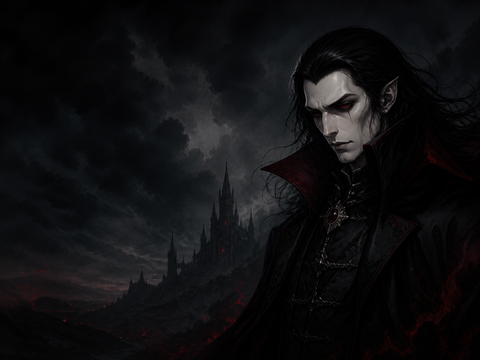

# Innioasis Vampire Theme

An install-ready gothic theme for the stock Innioasis Y1 music player. The visual system uses velvet black, cold silver and blood-crimson accents, with an original vampire portrait and a deliberately subdued menu wallpaper for readable white text.

## What is included

- Original 480×360 desktop and global wallpapers
- 500×500 theme-selector cover
- Twelve recoloured home-page icons, including the newer `ebook` entry
- Complete settings icon set and selected/dialog states
- Valid `config.json` with theme metadata and exact case-sensitive asset references

## Install

1. Download or clone this repository.
2. Connect the Innioasis Y1 to your computer and enable USB mode.
3. Copy the complete `Vampire` folder into the player's `Themes` folder. On the player this is `/storage/sdcard0/Themes/Vampire/`.
4. Open the Y1 app, then choose **Settings → Theme → Vampire** and confirm.

Do not copy only the wallpaper or the files inside the folder—the player expects `config.json`, `cover.png`, and all referenced assets to remain together inside `Vampire`.

## Local working copy

The same ready-to-use folder is installed at `D:\Themes\Vampire` on the creator's Windows machine.

## Design notes

The supplied gothic vampire artwork was used as a mood and palette reference. The packaged portrait and wallpaper are newly generated theme assets; the source reference image is not redistributed in this repository.

## Compatibility and validation

The package follows the stock Innioasis Y1 theme structure and uses PNG assets at the same dimensions as a complete bundled theme. Its JSON and asset references are checked before publishing. A final on-device visual check is still recommended because the physical player's firmware controls rendering.
